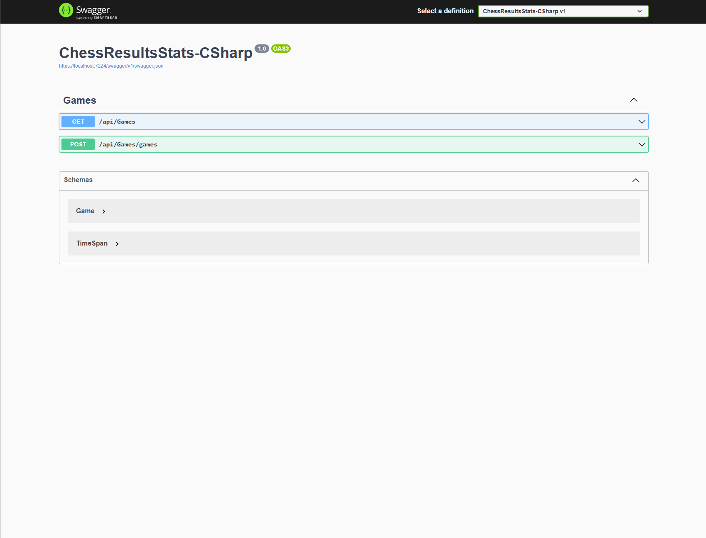

# Chess Results Stats - CSharp

## The project

The purpose of this project is to visualize your chess game stats,

The application is built with C# 12.0 and .NET 8.0, and you can download the Angular interface here : https://github.com/ironjerseys/ChessResultsStats-Angular

## How it works

This website calls an API from Chess.com to collect data from the wanted username

You can see the results in the charts

## How to install it :

```
git clone https://github.com/ironjerseys/ChessResultsStats-CSharp.git
```

-   Open the .sln file with your IDE

-   Launch the project to use the Swagger


